# Circuitos

Cada PNG é 500×500, vista de cima.

- **cinza claro** — traçado da pista (superfície, `halfWidth`)
- **azul** — linha guia dos NPCs (candidato `classic`)
- **amarelo** — pontos de pursuit: de onde o NPC está até o ponto que ele mira (~37 units à frente a 55 u/s)
- **branco** — start/finish

## Thunder Basin

### Thunder Basin

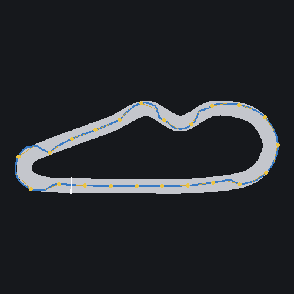

### Thunder Basin II

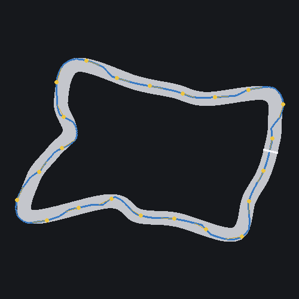

### Thunder Basin III

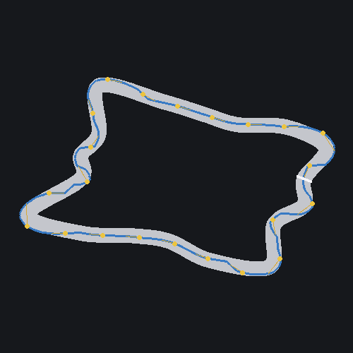

## Chrome Verge

### Chrome Verge I

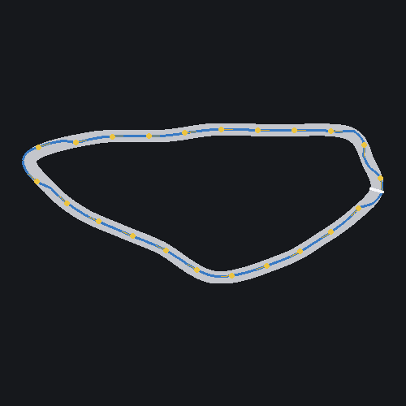

### Chrome Verge II

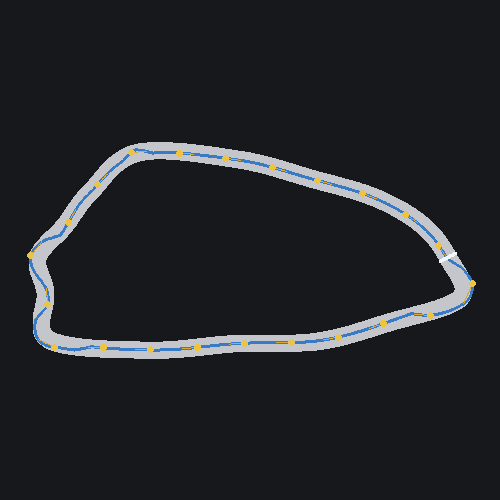

### Chrome Verge III

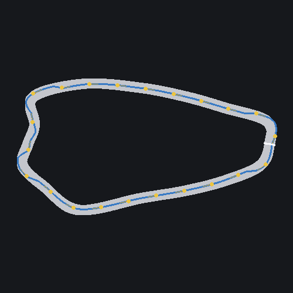

## Bogmire Deep

### Bogmire Deep I

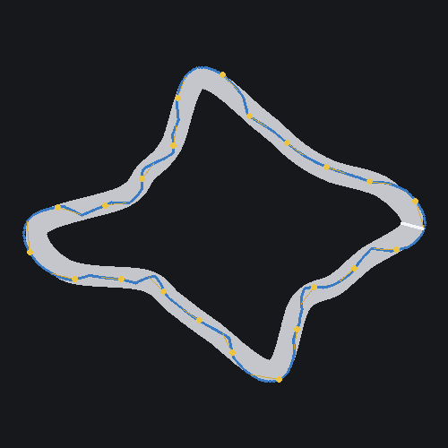

### Bogmire Deep II

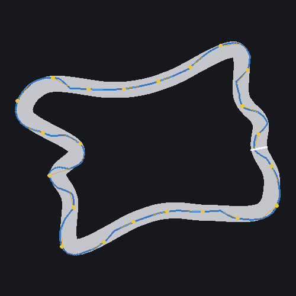

### Bogmire Deep III

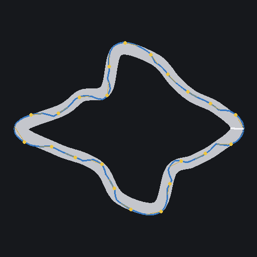

## Cryo Hollow

### Cryo Hollow I

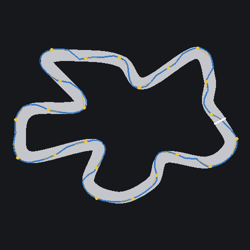

### Cryo Hollow II

### Cryo Hollow III

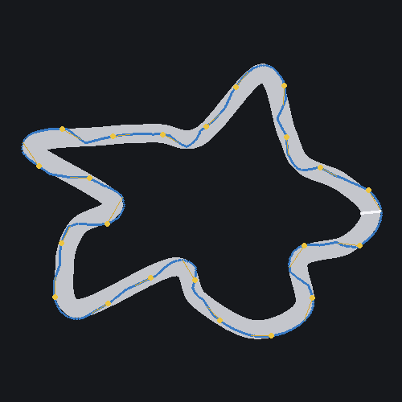

## Ferro Rust

### Ferro Rust I

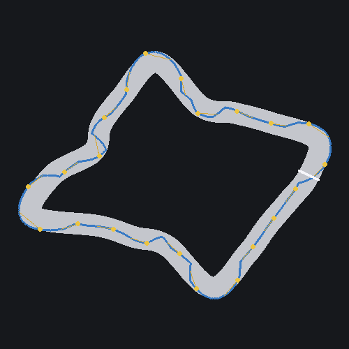

### Ferro Rust II

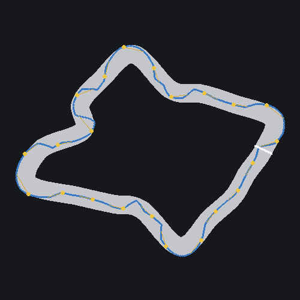

### Ferro Rust III

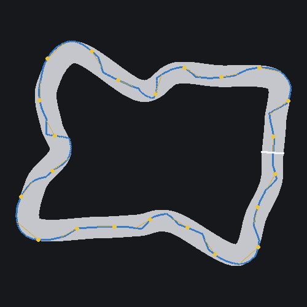

## Vulkanis

### Vulkanis I

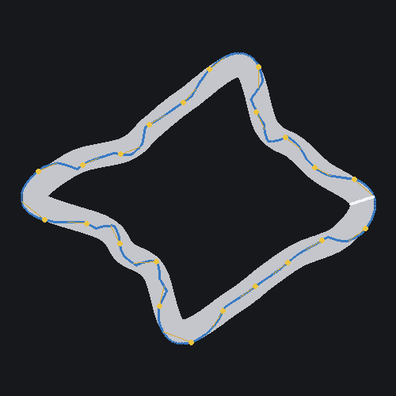

### Vulkanis II

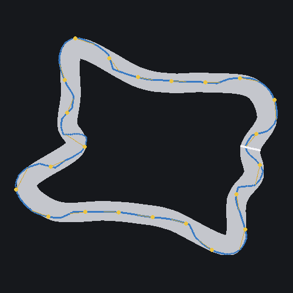

### Vulkanis III

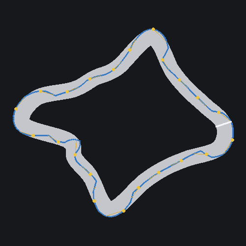

## Neon Kasbah

### Neon Kasbah I

### Neon Kasbah II

### Neon Kasbah III

## Ash Reach

### Ash Reach I

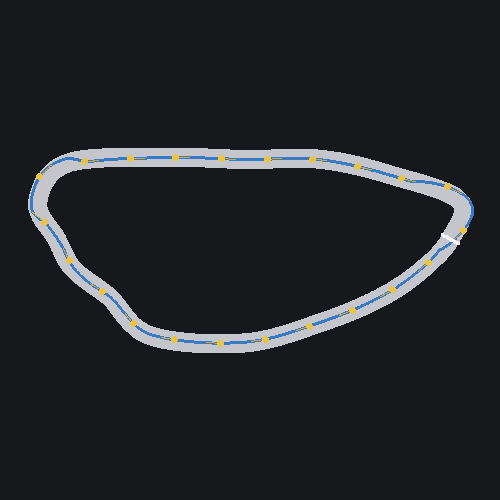

### Ash Reach II

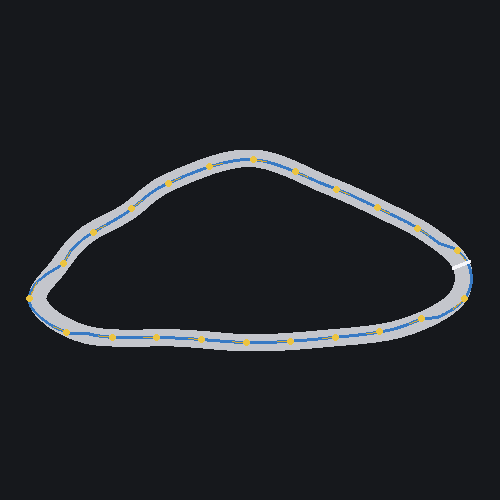

### Ash Reach III

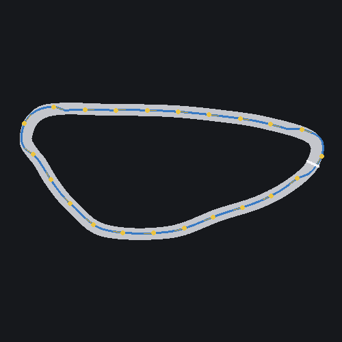

## Voidport

### Voidport I

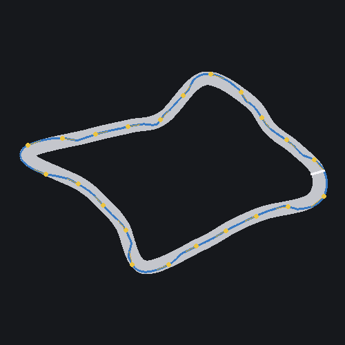

### Voidport II

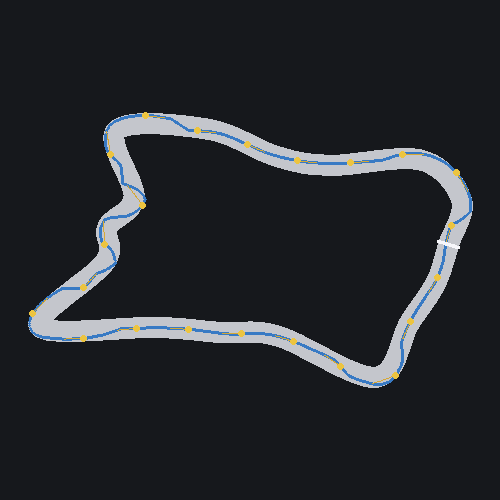

### Voidport III

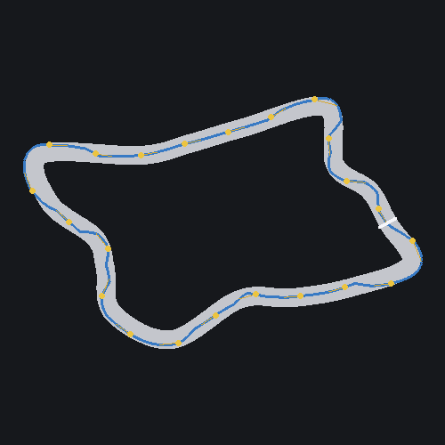

## Verdant Fault

### Verdant Fault I

### Verdant Fault II

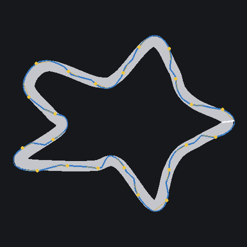

### Verdant Fault III

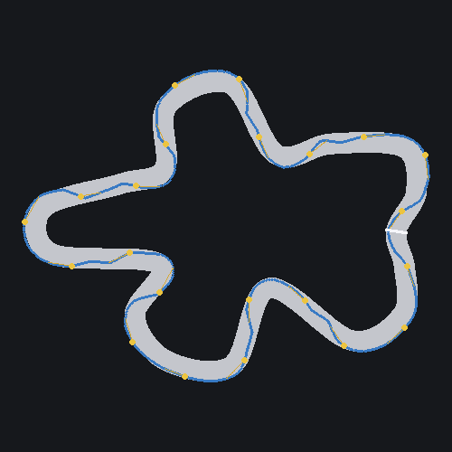

