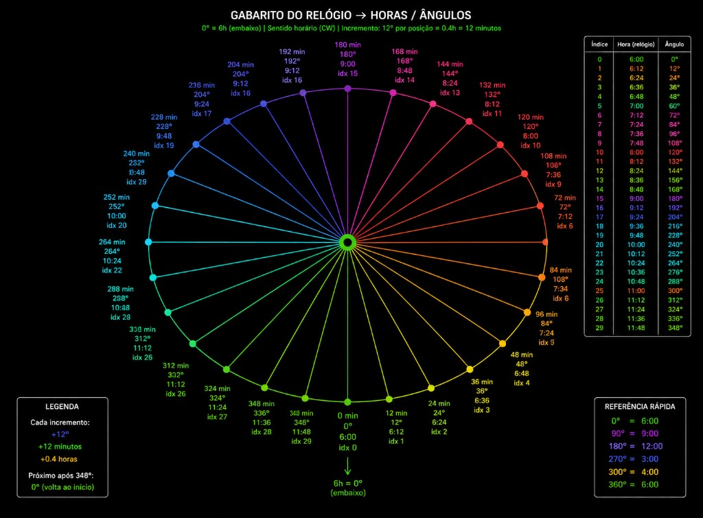

# Relógio + índice das 30 imagens — OBSOLETE

**Do not use.** Live playable cars use the 32-frame CCW spinner clock: [`../assets/cars/RELOGIO.md`](../assets/cars/RELOGIO.md) (index 0 = 6h, +11.25° CCW, hero = frame 07). Skill: isometric-car-spinner.

This file is the historical 30-slot CW table for leftover `public/matrix_car/` art.

# Relógio + índice das 30 imagens (arquivo)

**Pasta:** `public/matrix_car/`  
**Gabarito visual (histórico):** [`GABARITO_RELOGIO.png`](./GABARITO_RELOGIO.png)



## Regras (igual ao gabarito)

| | |
|--|--|
| Frente absoluta | **`0°`** (`indice[0]`, 6:00 no diagrama) |
| Traseira absoluta | **`12h` = `180°`** (`indice[15]`) |
| Passo | **+12°** = **+0.4 h** no ponteiro de 12 h |
| Sentido | horário (CW) |
| Volta | após `348°` → `0°` (`indice[0]`) |
| **Hero base** | **entre 4h e 3h** (tipicamente **4:00 = 300° = indice[25]**) |
| Costas (olho) | `indice[13]` ou `indice[14]`; grade também tem `15 = 12:00` |
| Zero Costas (contrato) | `indice[29] = 5:36 = 348°` |

**`car_N_hero.png` = vitrine** — não mexer.

### Referência rápida (gabarito)

| ângulo | hora |
|-------:|------|
| 0° | 6:00 |
| 90° | 9:00 |
| 180° | 12:00 |
| 270° | 3:00 |
| 300° | 4:00 |
| 360° | 6:00 |

*(90° e 270° não caem em índice inteiro da grade de 12°; são só marcos.)*

## Tabela oficial (30 slots)

Fórmula: `ângulo = índice × 12` · `hora = 6:00 + índice × 0.4 h`

```
indice[0]  = 6:00 =   0°
indice[1]  = 6:24 =  12°
indice[2]  = 6:48 =  24°
indice[3]  = 7:12 =  36°
indice[4]  = 7:36 =  48°
indice[5]  = 8:00 =  60°
indice[6]  = 8:24 =  72°
indice[7]  = 8:48 =  84°
indice[8]  = 9:12 =  96°
indice[9]  = 9:36 = 108°
indice[10] = 10:00 = 120°
indice[11] = 10:24 = 132°
indice[12] = 10:48 = 144°
indice[13] = 11:12 = 156° --> Costas aqui ou
indice[14] = 11:36 = 168° --> Ou Costas aqui
indice[15] = 12:00 = 180°
indice[16] = 12:24 = 192°
indice[17] = 12:48 = 204°
indice[18] =  1:12 = 216°
indice[19] =  1:36 = 228°
indice[20] =  2:00 = 240°
indice[21] =  2:24 = 252°
indice[22] =  2:48 = 264°
indice[23] =  3:12 = 276°
indice[24] =  3:36 = 288°
indice[25] =  4:00 = 300° --> Começamos aqui (vitrine)
indice[26] =  4:24 = 312°
indice[27] =  4:48 = 324°
indice[28] =  5:12 = 336°
indice[29] =  5:36 = 348° = indice Zero Costas
```

Equivale ao decimal antigo: `6.0, 6.4, 6.8, …, 4.0, …, 5.6`.

| índice | hora | ângulo | arquivo | nota |
|------:|------|-------:|---------|------|
| 0 | 6:00 | 0° | `a000` | frente |
| 1 | 6:24 | 12° | `a001` | |
| 2 | 6:48 | 24° | `a002` | |
| 3 | 7:12 | 36° | `a003` | |
| 4 | 7:36 | 48° | `a004` | |
| 5 | 8:00 | 60° | `a005` | |
| 6 | 8:24 | 72° | `a006` | |
| 7 | 8:48 | 84° | `a007` | |
| 8 | 9:12 | 96° | `a008` | |
| 9 | 9:36 | 108° | `a009` | |
| 10 | 10:00 | 120° | `a010` | |
| 11 | 10:24 | 132° | `a011` | |
| 12 | 10:48 | 144° | `a012` | |
| 13 | 11:12 | 156° | `a013` | **Costas?** |
| 14 | 11:36 | 168° | `a014` | **Costas?** |
| 15 | 12:00 | 180° | `a015` | costas na grade |
| 16 | 12:24 | 192° | `a016` | |
| 17 | 12:48 | 204° | `a017` | |
| 18 | 1:12 | 216° | `a018` | |
| 19 | 1:36 | 228° | `a019` | |
| 20 | 2:00 | 240° | `a020` | |
| 21 | 2:24 | 252° | `a021` | |
| 22 | 2:48 | 264° | `a022` | |
| 23 | 3:12 | 276° | `a023` | |
| 24 | 3:36 | 288° | `a024` | |
| 25 | 4:00 | 300° | `a025` | **START** |
| 26 | 4:24 | 312° | `a026` | |
| 27 | 4:48 | 324° | `a027` | |
| 28 | 5:12 | 336° | `a028` | |
| 29 | 5:36 | 348° | `a029` | **Zero Costas** |

- Arquivo do array: `car_N_a{índice:03d}.png`
- Buracos **não** se recompactam

### Inventário `1_hero`

- **ok (26):** 0–3, 5–11, 13–14, 16–24, 26–29  
- **faltando (4):** **4**, **12**, **15**, **25**

Ver: `README.md`, `PROMPT_30.md`, `1_hero/INDEX_ANGLES.md`.
